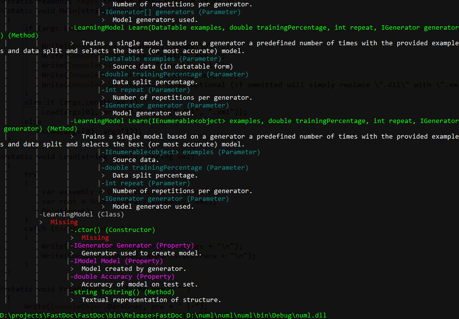

# FastDoc

Designed to be a simpler way for self documenting assemblies that use xml comments. It is still in the early stage.

## Usage ##
Download, compile, run FastDoc.exe

        FastDoc.exe Assembly.dll [Assembly.xml]
        xml optional (if ommitted will simply replace ".dll" with ".xml")

Seth Juarez ([@sethjuarez](https://twitter.com/sethjuarez "@sethjuarez")) for questions.

# Current Thinking

The design is separated into structural and information nodes.

## Structural (namespace as root)
1. class
	- Constants
	- Fields
	- Methods
	- Properties
	- Indexers
	- Events
	- Operators
	- Constructors
	- Destructors
	- Types - nested
2. interface
	- subset of class
3. enum
	- items
4. struct
	- subset of class
5. delegate
	- single item
6. (another namespace)

## informational (general sense)
1. short description
2. example
3. long description
4. related things

## XmlDoc Markup Supported
1. c
2. code
3. example
4. exception
5. **NOT include**
6. list
7. para
8. param
9. paramref
10. **NOT permission**
11. remarks
12. returns
13. see
14. seealso
15. summary
16. value